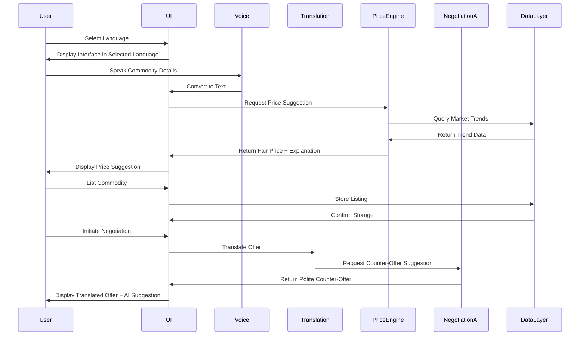

# Design Document: The Multilingual Mandi

## Overview

The Multilingual Mandi is a web-based visualization concept demonstrating how Generative AI can transform India's local markets. The platform addresses critical barriers in traditional mandi systems: language diversity, opaque pricing, negotiation power imbalances, and digital exclusion of low-literacy users.

The design follows a voice-first philosophy, enabling vendors and buyers to interact naturally in their native Indian languages while AI systems provide transparent price discovery, intelligent negotiation assistance, and real-time translation. This is a demonstration concept focused on visual clarity and impact, not a production-ready system.

### Design Philosophy

1. **Voice-First**: Primary interaction through speech, with text as secondary
2. **Inclusive**: Accessible to low-literacy users through visual design and voice
3. **Transparent**: AI decisions are explained clearly and simply
4. **Empowering**: AI assists without dominating user decision-making
5. **India-First**: Culturally appropriate, multilingual, context-aware

### Technology Approach

This is a visualization concept using Generative AI to demonstrate:

- Natural language understanding across Indian languages
- Intelligent price suggestion based on market simulation
- Culturally-aware negotiation assistance
- Real-time translation with context preservation

## Architecture

### High-Level Architecture

```
┌─────────────────────────────────────────────────────────────┐
│                     User Interface Layer                     │
│  ┌──────────────┐  ┌──────────────┐  ┌──────────────┐      │
│  │  Language    │  │   Vendor     │  │  Negotiation │      │
│  │  Selection   │  │  Dashboard   │  │   Interface  │      │
│  └──────────────┘  └──────────────┘  └──────────────┘      │
│  ┌──────────────┐  ┌──────────────┐                        │
│  │ Mandi Board  │  │ Voice Input  │                        │
│  └──────────────┘  └──────────────┘                        │
└─────────────────────────────────────────────────────────────┘
                            │
                            ▼
┌─────────────────────────────────────────────────────────────┐
│                   AI Services Layer                          │
│  ┌──────────────┐  ┌──────────────┐  ┌──────────────┐      │
│  │ Translation  │  │ Price Engine │  │ Negotiation  │      │
│  │   Service    │  │              │  │  Assistant   │      │
│  └──────────────┘  └──────────────┘  └──────────────┘      │
│  ┌──────────────┐  ┌──────────────┐                        │
│  │ Voice-to-Text│  │ Text-to-Speech│                       │
│  └──────────────┘  └──────────────┘                        │
└─────────────────────────────────────────────────────────────┘
                            │
                            ▼
┌─────────────────────────────────────────────────────────────┐
│                     Data Layer                               │
│  ┌──────────────┐  ┌──────────────┐  ┌──────────────┐      │
│  │  Commodity   │  │   Market     │  │ Negotiation  │      │
│  │   Listings   │  │   Trends     │  │   History    │      │
│  └──────────────┘  └──────────────┘  └──────────────┘      │
└─────────────────────────────────────────────────────────────┘
```

### Component Interaction Flow



## Components and Interfaces

### 1. Language Selection Component

**Purpose**: Entry point for users to select their preferred Indian language

**Interface**:

```typescript
interface LanguageSelectionComponent {
  // Display available languages
  displayLanguages(): LanguageOption[];

  // Handle language selection
  selectLanguage(languageCode: string): void;

  // Handle voice-based language selection
  selectLanguageByVoice(voiceInput: AudioInput): void;

  // Transition to main interface
  proceedToMainInterface(selectedLanguage: string): void;
}

interface LanguageOption {
  code: string; // e.g., "hi", "ta", "bn"
  name: string; // Native script name
  nativeScript: string; // e.g., "हिंदी", "தமிழ்"
  voiceEnabled: boolean;
}
```

**Visual Design**:

- Large tiles (minimum 120px × 120px) for each language
- Language name in native script (large, bold font)
- High contrast colors (earthy tones: terracotta, olive, cream)
- Prominent microphone icon for voice selection
- Minimal text, universal icons

### 2. Voice Interface Component

**Purpose**: Convert speech to text and text to speech in user's selected language

**Interface**:

```typescript
interface VoiceInterface {
  // Start listening for voice input
  startListening(language: string): void;

  // Stop listening and process input
  stopListening(): Promise<string>;

  // Convert speech to text
  speechToText(audio: AudioInput, language: string): Promise<string>;

  // Convert text to speech
  textToSpeech(text: string, language: string): Promise<AudioOutput>;

  // Handle unclear input
  requestClarification(language: string): void;

  // Provide voice feedback for actions
  provideVoiceFeedback(action: string, language: string): void;
}

interface AudioInput {
  data: ArrayBuffer;
  format: string;
  sampleRate: number;
}

interface AudioOutput {
  data: ArrayBuffer;
  format: string;
  duration: number;
}
```

**Behavior**:

- Continuous listening mode with visual feedback (pulsing microphone icon)
- Automatic language detection within selected language family
- Clear error messages in user's language when input is unclear
- Voice confirmation for all critical actions

### 3. Translation Service Component

**Purpose**: Translate messages between different Indian languages in real-time

**Interface**:

```typescript
interface TranslationService {
  // Translate text between languages
  translate(
    text: string,
    sourceLanguage: string,
    targetLanguage: string,
  ): Promise<TranslationResult>;

  // Translate with context preservation
  translateWithContext(
    text: string,
    sourceLanguage: string,
    targetLanguage: string,
    context: ConversationContext,
  ): Promise<TranslationResult>;

  // Handle culturally specific terms
  translateCulturalTerm(
    term: string,
    sourceLanguage: string,
    targetLanguage: string,
  ): Promise<string>;
}

interface TranslationResult {
  translatedText: string;
  sourceLanguage: string;
  targetLanguage: string;
  confidence: number;
  preservedIntent: boolean;
}

interface ConversationContext {
  topic: string; // e.g., "commodity_negotiation"
  previousMessages: Message[];
  culturalContext: string; // e.g., "rural_mandi"
}
```

**AI Behavior**:

- Use Generative AI for context-aware translation
- Preserve negotiation tone (polite, respectful, neutral)
- Handle mandi-specific terminology (commodity names, units, pricing terms)
- Maintain cultural appropriateness across language pairs

### 4. AI Price Engine Component

**Purpose**: Generate fair price suggestions based on simulated market conditions

**Interface**:

```typescript
interface AIPriceEngine {
  // Generate price suggestion for commodity
  suggestPrice(commodity: CommodityDetails): Promise<PriceSuggestion>;

  // Explain price reasoning
  explainPrice(
    commodity: CommodityDetails,
    suggestedPrice: PriceSuggestion,
  ): Promise<PriceExplanation>;

  // Update prices based on market changes
  updatePriceForMarketConditions(
    commodityId: string,
    marketConditions: MarketConditions,
  ): Promise<PriceSuggestion>;
}

interface CommodityDetails {
  name: string;
  category: string;
  quantity: number;
  unit: string;
  quality: string;
  location: string;
  season: string;
}

interface PriceSuggestion {
  minPrice: number;
  maxPrice: number;
  recommendedPrice: number;
  currency: string;
  confidence: number;
}

interface PriceExplanation {
  factors: PriceFactor[];
  summary: string; // Brief explanation in user's language
  detailedReasoning: string; // Expanded explanation if requested
}

interface PriceFactor {
  name: string; // e.g., "seasonal_demand", "local_supply"
  impact: number; // -1 to 1 (negative = lower price, positive = higher)
  description: string; // Simple explanation
}

interface MarketConditions {
  localDemand: number;
  regionalSupply: number;
  seasonalTrend: string;
  weatherImpact: number;
  festivalSeason: boolean;
}
```

**AI Behavior**:

- Simulate realistic market trends based on Indian agricultural patterns
- Consider seasonality (monsoon, harvest seasons, festivals)
- Factor in location-based supply/demand
- Provide transparent, simple explanations
- Use respectful, empowering language

### 5. AI Negotiation Assistant Component

**Purpose**: Generate polite, culturally appropriate negotiation suggestions

**Interface**:

```typescript
interface AINegotiationAssistant {
  // Generate counter-offer suggestion
  suggestCounterOffer(
    currentOffer: Offer,
    fairPriceRange: PriceSuggestion,
    negotiationHistory: NegotiationHistory,
  ): Promise<CounterOfferSuggestion>;

  // Generate polite acceptance message
  generateAcceptanceMessage(
    finalOffer: Offer,
    userLanguage: string,
  ): Promise<string>;

  // Suggest compromise when negotiation stalls
  suggestCompromise(
    buyerOffer: Offer,
    vendorOffer: Offer,
    fairPriceRange: PriceSuggestion,
  ): Promise<CompromiseSuggestion>;

  // Explain negotiation suggestion
  explainSuggestion(suggestion: CounterOfferSuggestion): Promise<string>;
}

interface Offer {
  price: number;
  quantity: number;
  proposedBy: string; // "buyer" or "vendor"
  timestamp: Date;
  language: string;
}

interface CounterOfferSuggestion {
  suggestedPrice: number;
  message: string; // Polite counter-offer message
  reasoning: string; // Why this counter-offer
  acceptanceOption: boolean; // Whether to also show "accept" option
  tone: string; // "polite", "firm", "flexible"
}

interface CompromiseSuggestion {
  compromisePrice: number;
  message: string;
  reasoning: string;
}

interface NegotiationHistory {
  offers: Offer[];
  duration: number; // Time spent negotiating
  numberOfRounds: number;
}
```

**AI Behavior**:

- Generate culturally neutral, respectful messages
- Avoid aggressive or confrontational language
- Suggest fair compromises based on price range
- Maintain consistent tone across translations
- Empower users without dominating decisions

### 6. Digital Mandi Board Component

**Purpose**: Display all active commodity listings with visual hierarchy

**Interface**:

```typescript
interface DigitalMandiBoard {
  // Display all listings
  displayListings(filters?: ListingFilters): CommodityListing[];

  // Highlight best prices
  highlightBestPrices(commodity: string): void;

  // Update board in real-time
  updateListing(listingId: string, updates: Partial<CommodityListing>): void;

  // Remove sold listings
  markAsSold(listingId: string): void;

  // Filter by location
  filterByLocation(location: string): CommodityListing[];
}

interface CommodityListing {
  id: string;
  commodityName: string;
  vendorName: string;
  location: string;
  quantity: number;
  unit: string;
  price: number;
  currency: string;
  quality: string;
  listedAt: Date;
  status: "active" | "negotiating" | "sold";
  isBestPrice: boolean;
}

interface ListingFilters {
  commodity?: string;
  location?: string;
  priceRange?: { min: number; max: number };
  quality?: string;
}
```

**Visual Design**:

- Card-based layout with clear visual hierarchy
- Best price highlighted with distinct color (e.g., green border, star icon)
- Location tags with map pin icons
- Large, readable fonts for prices
- Status indicators (active, negotiating, sold)
- Responsive grid layout

### 7. Vendor Dashboard Component

**Purpose**: Allow vendors to list commodities and view AI price suggestions

**Interface**:

```typescript
interface VendorDashboard {
  // Create new commodity listing
  createListing(details: CommodityDetails): Promise<CommodityListing>;

  // Request AI price suggestion
  requestPriceSuggestion(details: CommodityDetails): Promise<PriceSuggestion>;

  // Display price explanation
  showPriceExplanation(
    commodity: CommodityDetails,
    suggestion: PriceSuggestion,
  ): void;

  // View active listings
  viewMyListings(): CommodityListing[];

  // View negotiation status
  viewNegotiations(): NegotiationStatus[];
}

interface NegotiationStatus {
  listingId: string;
  buyerName: string;
  currentOffer: Offer;
  status: "pending" | "active" | "completed";
  lastActivity: Date;
}
```

**Visual Design**:

- Commodity card with prominent price display
- "Why this price?" button/panel (expandable)
- AI suggestion badge/indicator
- Clear call-to-action buttons (List, Edit, View Offers)
- Voice input button for commodity details

### 8. Negotiation Interface Component

**Purpose**: Facilitate negotiation between buyer and vendor with AI assistance

**Interface**:

```typescript
interface NegotiationInterface {
  // Display negotiation conversation
  displayConversation(negotiationId: string): Message[];

  // Send offer
  sendOffer(offer: Offer): Promise<void>;

  // Display AI suggestion
  showAISuggestion(suggestion: CounterOfferSuggestion): void;

  // Accept offer with one tap
  acceptOffer(offerId: string): Promise<void>;

  // Send counter-offer with AI assistance
  sendCounterOffer(
    counterOffer: Offer,
    useAISuggestion: boolean,
  ): Promise<void>;

  // Finalize deal
  finalizeDeal(negotiationId: string, finalTerms: Offer): Promise<Deal>;
}

interface Message {
  id: string;
  sender: string; // "buyer" or "vendor"
  text: string;
  originalLanguage: string;
  translatedText?: string;
  timestamp: Date;
  type: "offer" | "counter" | "message" | "acceptance";
}

interface Deal {
  negotiationId: string;
  commodity: CommodityDetails;
  finalPrice: number;
  quantity: number;
  buyer: string;
  vendor: string;
  agreedAt: Date;
}
```

**Visual Design**:

- Split-view layout (buyer on left, vendor on right)
- Language tags on each message (small badge with language code)
- AI suggestion panel (bottom or side, highlighted)
- One-tap action buttons (Accept, Counter, Suggest)
- Conversation history with clear visual distinction between parties
- Progress indicator showing negotiation rounds

## Data Models

### User Model

```typescript
interface User {
  id: string;
  name: string;
  role: "vendor" | "buyer" | "observer";
  preferredLanguage: string;
  location: string;
  phoneNumber?: string; // Optional for demo
  voicePreference: boolean;
  literacyLevel: "low" | "medium" | "high";
}
```

### Commodity Model

```typescript
interface Commodity {
  id: string;
  name: string;
  category: string; // e.g., "grains", "vegetables", "fruits"
  localNames: Map<string, string>; // Language code -> local name
  standardUnit: string; // e.g., "kg", "quintal", "ton"
  seasonality: string[]; // Months when in season
}
```

### Listing Model

```typescript
interface Listing {
  id: string;
  vendorId: string;
  commodityId: string;
  quantity: number;
  unit: string;
  price: number;
  currency: string;
  quality: string;
  location: string;
  aiSuggestedPrice: PriceSuggestion;
  priceExplanation: PriceExplanation;
  listedAt: Date;
  expiresAt: Date;
  status: "active" | "negotiating" | "sold" | "expired";
}
```

### Negotiation Model

```typescript
interface Negotiation {
  id: string;
  listingId: string;
  buyerId: string;
  vendorId: string;
  messages: Message[];
  offers: Offer[];
  currentStatus: "initiated" | "active" | "completed" | "cancelled";
  startedAt: Date;
  completedAt?: Date;
  finalDeal?: Deal;
}
```

### Market Trend Model (Simulated)

```typescript
interface MarketTrend {
  commodityId: string;
  location: string;
  date: Date;
  averagePrice: number;
  demandLevel: number; // 0-1 scale
  supplyLevel: number; // 0-1 scale
  seasonalFactor: number; // Multiplier based on season
  weatherImpact: number; // -1 to 1
  festivalImpact: number; // Multiplier for festival seasons
}
```

## Correctness Properties

_A property is a characteristic or behavior that should hold true across all valid executions of a system—essentially, a formal statement about what the system should do. Properties serve as the bridge between human-readable specifications and machine-verifiable correctness guarantees._

### Property Reflection

After analyzing all acceptance criteria, I identified the following redundancies and consolidations:

**Redundancy Analysis:**

- Properties 3.1 and 8.2 both test price generation for commodities → Consolidated into Property 1
- Properties 3.2, 8.3, and 10.1 all test price explanation presence → Consolidated into Property 2
- Properties 2.2 and 9.2 both test language tag display → Consolidated into Property 5
- Properties 4.5 and 10.2 both test negotiation suggestion explanations → Consolidated into Property 8
- Properties 5.1 and 5.4 both test listing display on mandi board → Consolidated into Property 10
- Properties 8.4 and 8.5 both test listing creation and board update → Consolidated into Property 13

**Edge Cases Handled by Generators:**

- Voice input clarity (1.6) - handled by voice input generator
- Cultural term translation (2.4) - handled by translation test examples
- UI design elements (6.1, 7.2, 7.5, 12.1-12.4) - handled by visual testing examples

### Core Properties

**Property 1: Language Configuration Consistency**

_For any_ supported language selection, all interface elements and AI responses should be configured in that selected language.

**Validates: Requirements 1.2**

**Property 2: Language Switching Updates Interface**

_For any_ initial language and any different target language, switching from the initial to the target language should result in all interface elements updating to the target language.

**Validates: Requirements 1.5**

**Property 3: Voice-to-Text Round Trip**

_For any_ text input in a supported language, converting it to speech and then back to text should preserve the semantic content of the original text.

**Validates: Requirements 1.3**

**Property 4: Cross-Language Translation Preservation**

_For any_ message in a source language and any different target language, translating the message should produce output in the target language that preserves the core meaning.

**Validates: Requirements 2.1**

**Property 5: Translation Language Tag Display**

_For any_ translated message, the displayed translation should include a language tag indicating the original source language.

**Validates: Requirements 2.2, 9.2**

**Property 6: Price Generation for Commodities**

_For any_ commodity with valid details (name, quantity, location, quality), the AI Price Engine should generate a fair price range with minimum, maximum, and recommended prices.

**Validates: Requirements 3.1, 8.2**

**Property 7: Price Explanation Presence**

_For any_ AI-generated price suggestion, the system should provide an explanation containing at least one price factor and a summary description.

**Validates: Requirements 3.2, 8.3, 10.1**

**Property 8: Price Update on Market Changes**

_For any_ commodity listing and any change in market conditions (demand, supply, seasonality), the AI Price Engine should update the price suggestion to reflect the new conditions.

**Validates: Requirements 3.3**

**Property 9: Price Consistency for Similar Commodities**

_For any_ set of commodity listings of the same type, listings with identical quality and location should have price suggestions within 10% of each other.

**Validates: Requirements 3.5**

**Property 10: Counter-Offer Generation**

_For any_ buyer offer on a commodity, the AI Negotiation Assistant should generate a counter-offer suggestion that includes a suggested price, a polite message, and reasoning.

**Validates: Requirements 4.1**

**Property 11: Negotiation Suggestion Explanation**

_For any_ AI-generated negotiation suggestion (counter-offer or compromise), the system should provide an explanation of the reasoning behind the suggestion.

**Validates: Requirements 4.5, 10.2**

**Property 12: Active Listings Display**

_For any_ set of commodity listings with status "active", the Digital Mandi Board should display all of them.

**Validates: Requirements 5.1, 5.4**

**Property 13: Listing Field Completeness**

_For any_ commodity listing displayed on the Digital Mandi Board, the display should include commodity name, vendor location, quantity, and current price.

**Validates: Requirements 5.2**

**Property 14: Best Price Highlighting**

_For any_ commodity type with multiple active listings, the listing with the lowest price should be highlighted as the best price.

**Validates: Requirements 5.3**

**Property 15: Listing Status Update on Deal Finalization**

_For any_ commodity listing, when a deal is finalized for that listing, the listing status should change to "sold" or be removed from active listings.

**Validates: Requirements 5.5**

**Property 16: Voice Feedback for Interactions**

_For any_ user interaction that modifies state (listing creation, offer submission, deal finalization), the system should provide voice feedback confirming the action.

**Validates: Requirements 6.3**

**Property 17: Voice Command Completeness**

_For any_ primary action in the system (list commodity, make offer, accept deal, select language), there should exist a voice command that can complete that action.

**Validates: Requirements 6.6**

**Property 18: Language Tile Interaction Feedback**

_For any_ language tile in the language selection interface, hovering over or focusing on the tile should provide visual feedback (color change, border, or animation).

**Validates: Requirements 7.3**

**Property 19: Listing Creation and Board Update**

_For any_ vendor creating a commodity listing, the listing should appear on the Digital Mandi Board immediately after creation.

**Validates: Requirements 8.4, 8.5**

**Property 20: Vendor Listing Status Display**

_For any_ vendor viewing their listings, each listing should display its current negotiation status (no offers, active negotiation, or completed).

**Validates: Requirements 8.6**

**Property 21: Offer Suggestion Panel Display**

_For any_ user receiving an offer during negotiation, the system should display an AI-generated suggestion panel with at least one recommended response.

**Validates: Requirements 9.3**

**Property 22: Negotiation History Maintenance**

_For any_ active negotiation, the system should maintain a complete conversation history showing all messages and offers in chronological order.

**Validates: Requirements 9.4**

**Property 23: Real-Time Negotiation Translation**

_For any_ negotiation between parties using different languages, each message should be translated and displayed to the recipient in their selected language in real-time.

**Validates: Requirements 9.6**

**Property 24: Vendor Listing Flow Completion**

_For any_ vendor listing a commodity, the system should execute the complete flow: accept commodity details → generate price suggestion → create listing → update mandi board, with each step completing successfully before the next begins.

**Validates: Requirements 11.2**

**Property 25: Buyer Negotiation Flow Completion**

_For any_ buyer initiating negotiation, the system should execute the complete flow: create offer → translate offer → generate AI suggestion → notify vendor, with each step completing successfully.

**Validates: Requirements 11.3**

**Property 26: Deal Finalization Flow Completion**

_For any_ negotiation reaching agreement, the system should execute the complete flow: confirm agreement → update listing status → create deal record, with each step completing successfully.

**Validates: Requirements 11.4**

### Example-Based Properties

These properties test specific scenarios or UI requirements that are best validated with concrete examples rather than randomized property tests.

**Example 1: Language Selection Interface Contains Required Languages**

The language selection screen should display tiles for all required languages: Hindi, Tamil, Bengali, Telugu, Marathi, Gujarati, Kannada, Malayalam, and Punjabi.

**Validates: Requirements 1.1**

**Example 2: Price Explanation Panel Display**

When a vendor requests price explanation for a commodity, the system should display a "Why this price?" panel containing the explanation.

**Validates: Requirements 3.4**

**Example 3: One-Tap Negotiation Options**

When a vendor receives an offer, the interface should provide one-tap buttons for both "Accept" and "Counter" actions.

**Validates: Requirements 4.2**

**Example 4: Compromise Suggestion on Impasse**

When a negotiation has more than 5 rounds with no agreement and offers are diverging, the AI should suggest a compromise price between the buyer and vendor offers.

**Validates: Requirements 4.4**

**Example 5: Voice-First Design Elements**

The platform interface should include large, high-contrast buttons with universal icons (microphone icon, checkmark icon, arrow icons).

**Validates: Requirements 6.1**

**Example 6: Language Selection as Entry Point**

When a user first accesses the platform (no session cookie), the system should display the language selection screen before any other interface.

**Validates: Requirements 7.1**

**Example 7: Language Tiles with Native Scripts**

The language selection screen should display each language name in its native script (e.g., "हिंदी" for Hindi, "தமிழ்" for Tamil).

**Validates: Requirements 7.2**

**Example 8: Voice Icon Display**

The language selection screen should display a prominent microphone icon indicating voice input capability.

**Validates: Requirements 7.5**

**Example 9: Voice Language Selection**

A user should be able to select a language by speaking the language name (e.g., saying "Hindi" or "हिंदी" should select Hindi).

**Validates: Requirements 7.6**

**Example 10: Vendor Dashboard Display**

When a vendor accesses their dashboard, the interface should display a commodity listing form with fields for commodity details.

**Validates: Requirements 8.1**

**Example 11: Split-View Negotiation Interface**

When negotiation begins, the interface should display a split-view layout with buyer perspective on one side and vendor perspective on the other.

**Validates: Requirements 9.1**

**Example 12: Deal Confirmation Screen**

When a deal is reached, the system should display a confirmation screen showing the final agreed price, quantity, and parties involved.

**Validates: Requirements 9.5**

**Example 13: User Onboarding Flow**

When a new user enters the platform, the system should guide them through: language selection → main interface display → feature introduction.

**Validates: Requirements 11.1**

**Example 14: Language Selection Screen Visualization**

The platform should provide a language selection screen with large language tiles (minimum 120px × 120px), voice icon, and minimal text.

**Validates: Requirements 12.1**

**Example 15: Vendor Dashboard Visualization**

The platform should provide a vendor dashboard showing commodity card, AI-suggested price with range, and "Why this price?" explanation panel.

**Validates: Requirements 12.2**

**Example 16: Negotiation Screen Visualization**

The platform should provide a negotiation screen with split buyer-vendor view, language tags on messages, and AI suggestion panel.

**Validates: Requirements 12.3**

**Example 17: Digital Mandi Board Visualization**

The platform should provide a digital mandi board with commodity listings in card format, best price highlighted with green border or star icon, and location tags with map pin icons.

**Validates: Requirements 12.4**

## Error Handling

### Voice Input Errors

**Unclear Speech Detection**:

- When voice input confidence is below 70%, request clarification
- Display what was understood and ask user to confirm or retry
- Provide option to switch to text input

**Unsupported Language Detection**:

- When voice input is detected in an unsupported language, notify user
- Suggest closest supported language
- Provide language selection option

**No Audio Input**:

- When microphone access is denied or unavailable, show clear error message
- Provide instructions for enabling microphone
- Offer text input as alternative

### Translation Errors

**Translation Service Unavailable**:

- When translation service fails, show error in user's language
- Queue message for retry
- Allow users to continue in single language mode

**Ambiguous Translation**:

- When translation confidence is low, show warning indicator
- Provide option to view original text
- Allow manual clarification request

### Price Engine Errors

**Insufficient Market Data**:

- When market data is incomplete, provide price range with wider bounds
- Clearly indicate uncertainty in explanation
- Suggest user research or manual pricing

**Invalid Commodity Details**:

- When commodity details are incomplete or invalid, highlight missing fields
- Provide voice guidance on what information is needed
- Offer examples of valid inputs

### Negotiation Errors

**Offer Outside Reasonable Range**:

- When offer is more than 50% outside fair price range, show warning
- Explain why offer may not be accepted
- Suggest adjusted offer closer to fair range

**Negotiation Timeout**:

- When negotiation is inactive for 24 hours, send reminder notification
- After 48 hours, mark negotiation as expired
- Allow reactivation if both parties agree

### Data Persistence Errors

**Listing Creation Failure**:

- When listing cannot be saved, show error message
- Preserve entered data in form
- Provide retry option with exponential backoff

**Deal Finalization Failure**:

- When deal cannot be saved, prevent listing status change
- Show error to both parties
- Provide manual retry option

### Network Errors

**Connection Loss**:

- When network connection is lost, show offline indicator
- Queue actions for when connection returns
- Provide clear feedback on what will happen when online

**Slow Connection**:

- When response time exceeds 5 seconds, show loading indicator
- Provide option to cancel and retry
- Cache frequently accessed data for offline access

## Testing Strategy

### Dual Testing Approach

The Multilingual Mandi platform requires both unit testing and property-based testing to ensure comprehensive correctness:

**Unit Tests**: Validate specific examples, edge cases, and error conditions

- Specific language selection scenarios
- UI component rendering with specific data
- Error handling for known failure modes
- Integration between components
- Specific cultural term translations

**Property Tests**: Verify universal properties across all inputs

- Language configuration consistency across all supported languages
- Translation preservation across all language pairs
- Price generation for all commodity types
- Negotiation flow completion for all offer scenarios
- Listing display for all commodity data

Both approaches are complementary and necessary. Unit tests catch concrete bugs in specific scenarios, while property tests verify general correctness across the input space.

### Property-Based Testing Configuration

**Testing Library Selection**:

- **JavaScript/TypeScript**: Use `fast-check` library for property-based testing
- **Python**: Use `hypothesis` library for property-based testing

**Test Configuration**:

- Each property test MUST run minimum 100 iterations
- Each property test MUST be tagged with a comment referencing the design property
- Tag format: `// Feature: multilingual-mandi, Property {number}: {property_text}`

**Example Property Test Structure** (TypeScript with fast-check):

```typescript
import fc from "fast-check";

// Feature: multilingual-mandi, Property 1: Language Configuration Consistency
test("all interface elements use selected language", () => {
  fc.assert(
    fc.property(
      fc.constantFrom("hi", "ta", "bn", "te", "mr", "gu", "kn", "ml", "pa"),
      (language) => {
        const platform = new Platform();
        platform.selectLanguage(language);

        const interfaceElements = platform.getAllInterfaceElements();

        // All elements should be in the selected language
        return interfaceElements.every(
          (element) => element.language === language,
        );
      },
    ),
    { numRuns: 100 },
  );
});

// Feature: multilingual-mandi, Property 6: Price Generation for Commodities
test("price engine generates valid price range for all commodities", () => {
  fc.assert(
    fc.property(commodityArbitrary(), (commodity) => {
      const priceEngine = new AIPriceEngine();
      const suggestion = priceEngine.suggestPrice(commodity);

      // Should have valid price range
      return (
        suggestion.minPrice > 0 &&
        suggestion.maxPrice > suggestion.minPrice &&
        suggestion.recommendedPrice >= suggestion.minPrice &&
        suggestion.recommendedPrice <= suggestion.maxPrice
      );
    }),
    { numRuns: 100 },
  );
});
```

**Example Unit Test Structure** (TypeScript with Jest):

```typescript
// Unit test for specific language selection scenario
test("language selection screen displays all required languages", () => {
  const languageScreen = new LanguageSelectionComponent();
  const languages = languageScreen.displayLanguages();

  const requiredLanguages = [
    "hi",
    "ta",
    "bn",
    "te",
    "mr",
    "gu",
    "kn",
    "ml",
    "pa",
  ];

  requiredLanguages.forEach((langCode) => {
    expect(languages.some((lang) => lang.code === langCode)).toBe(true);
  });
});

// Unit test for error handling
test("voice interface requests clarification for unclear input", () => {
  const voiceInterface = new VoiceInterface();
  const unclearAudio = createUnclearAudioInput(); // Low confidence

  const result = voiceInterface.speechToText(unclearAudio, "hi");

  expect(result.requiresClarification).toBe(true);
  expect(result.clarificationMessage).toContain("कृपया फिर से बोलें");
});
```

### Test Coverage Requirements

**Core Properties** (26 properties):

- Each property MUST have at least one property-based test
- Each property test MUST run 100+ iterations
- Each property test MUST be tagged with property reference

**Example-Based Properties** (17 examples):

- Each example MUST have at least one unit test
- Examples should cover UI rendering, specific flows, and edge cases

**Error Handling**:

- Each error scenario MUST have at least one unit test
- Error tests should verify error messages are in user's language
- Error tests should verify graceful degradation

**Integration Testing**:

- End-to-end flow tests for complete user journeys
- Cross-component integration tests
- Translation service integration tests

### Testing Priorities

**Priority 1 - Critical Path**:

1. Language selection and configuration (Properties 1, 2)
2. Price generation and explanation (Properties 6, 7)
3. Listing creation and display (Properties 12, 13, 19)
4. Negotiation flow (Properties 24, 25, 26)

**Priority 2 - Core Features**:

1. Translation functionality (Properties 4, 5, 23)
2. Voice interface (Properties 3, 16, 17)
3. AI negotiation assistance (Properties 10, 11)
4. Mandi board updates (Properties 14, 15)

**Priority 3 - Enhanced Experience**:

1. UI interactions (Properties 18, 20, 21, 22)
2. Price consistency (Property 9)
3. Market condition updates (Property 8)

### Mock Data and Generators

**Commodity Generator**:

```typescript
function commodityArbitrary(): fc.Arbitrary<CommodityDetails> {
  return fc.record({
    name: fc.constantFrom("Rice", "Wheat", "Tomato", "Onion", "Potato"),
    category: fc.constantFrom("grains", "vegetables", "fruits"),
    quantity: fc.integer({ min: 1, max: 1000 }),
    unit: fc.constantFrom("kg", "quintal", "ton"),
    quality: fc.constantFrom("premium", "standard", "economy"),
    location: fc.constantFrom("Delhi", "Mumbai", "Bangalore", "Chennai"),
    season: fc.constantFrom("summer", "winter", "monsoon", "all-year"),
  });
}
```

**Language Generator**:

```typescript
function languageArbitrary(): fc.Arbitrary<string> {
  return fc.constantFrom("hi", "ta", "bn", "te", "mr", "gu", "kn", "ml", "pa");
}
```

**Offer Generator**:

```typescript
function offerArbitrary(): fc.Arbitrary<Offer> {
  return fc.record({
    price: fc.integer({ min: 100, max: 10000 }),
    quantity: fc.integer({ min: 1, max: 100 }),
    proposedBy: fc.constantFrom("buyer", "vendor"),
    timestamp: fc.date(),
    language: languageArbitrary(),
  });
}
```

### Continuous Testing

**Pre-commit Hooks**:

- Run all unit tests
- Run fast property tests (10 iterations) for quick feedback

**CI/CD Pipeline**:

- Run all unit tests
- Run full property tests (100+ iterations)
- Generate coverage reports
- Fail build if coverage drops below 80%

**Manual Testing**:

- Visual regression testing for UI components
- Accessibility testing with screen readers
- User acceptance testing with target users (low-literacy vendors)
- Cross-browser testing (Chrome, Firefox, Safari, Edge)
- Mobile responsiveness testing

## Implementation Notes

### Technology Stack Recommendations

**Frontend**:

- React or Vue.js for component-based UI
- Tailwind CSS for rapid, accessible styling
- Web Speech API for voice input/output
- Socket.io for real-time updates

**AI Services**:

- OpenAI GPT-4 or Google Gemini for translation and negotiation
- Custom price engine using simulated market data
- Text-to-Speech: Google Cloud TTS or Azure TTS (supports Indian languages)
- Speech-to-Text: Google Cloud STT or Azure STT (supports Indian languages)

**Backend** (Minimal for demo):

- Node.js with Express for API
- In-memory data store or simple JSON files
- WebSocket server for real-time updates

**Deployment**:

- Static hosting (Vercel, Netlify) for frontend
- Serverless functions for AI service integration

### Visual Design Guidelines

**Color Palette** (Earthy, India-inspired):

- Primary: Terracotta (#E07A5F)
- Secondary: Olive Green (#81B29A)
- Background: Cream (#F4F1DE)
- Accent: Saffron (#F2CC8F)
- Text: Dark Brown (#3D405B)

**Typography**:

- Large, readable fonts (minimum 18px for body text)
- Support for Devanagari, Tamil, Bengali, Telugu, Gujarati scripts
- High contrast ratios (WCAG AAA compliance)

**Icons**:

- Universal symbols (microphone, checkmark, arrows, map pin)
- Minimum 48px × 48px for touch targets
- High contrast, simple designs

**Layout**:

- Generous spacing (minimum 16px between elements)
- Large touch targets (minimum 44px × 44px)
- Clear visual hierarchy
- Minimal text, maximum visual communication

### Accessibility Considerations

**Voice-First Design**:

- All primary actions accessible via voice
- Voice feedback for all state changes
- Clear voice prompts in user's language

**Low-Literacy Support**:

- Icons with minimal text labels
- Visual progress indicators
- Simple, conversational language
- Avoid technical jargon

**Screen Reader Support**:

- Semantic HTML
- ARIA labels for all interactive elements
- Logical tab order
- Skip navigation links

**Keyboard Navigation**:

- All functionality accessible via keyboard
- Visible focus indicators
- Logical tab order

### Performance Considerations

**Voice Processing**:

- Client-side voice activity detection to reduce API calls
- Streaming speech recognition for real-time feedback
- Audio compression before sending to API

**Translation**:

- Cache common translations
- Batch translation requests when possible
- Fallback to simpler translation for slow connections

**Real-Time Updates**:

- WebSocket connection for live mandi board
- Optimistic UI updates
- Conflict resolution for concurrent edits

**Mobile Optimization**:

- Responsive design for all screen sizes
- Touch-optimized interactions
- Reduced data usage for rural connectivity

### Demonstration Focus

Since this is a visualization concept for a competition, the implementation should prioritize:

1. **Visual Clarity**: Clear, compelling UI that demonstrates the concept
2. **AI Visibility**: Make AI contributions obvious and transparent
3. **Impact Communication**: Show how this solves real problems
4. **User Journey**: Complete, smooth flow from entry to deal completion
5. **India Context**: Authentic representation of Indian market dynamics

**Demo Script Recommendation**:

1. Show language selection (demonstrate multilingual support)
2. Vendor lists commodity (show AI price suggestion with explanation)
3. Buyer from different language initiates negotiation (show translation)
4. AI suggests counter-offers (show negotiation assistance)
5. Deal is finalized (show transparent outcome)
6. Mandi board updates (show market transparency)

Total demo time: Under 2 minutes to meet competition requirements.
