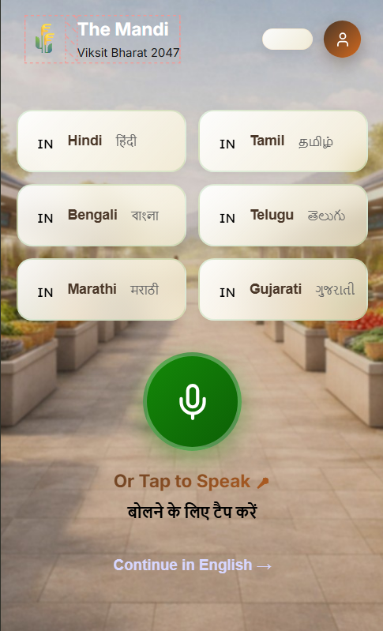
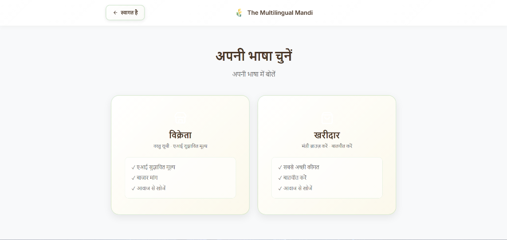
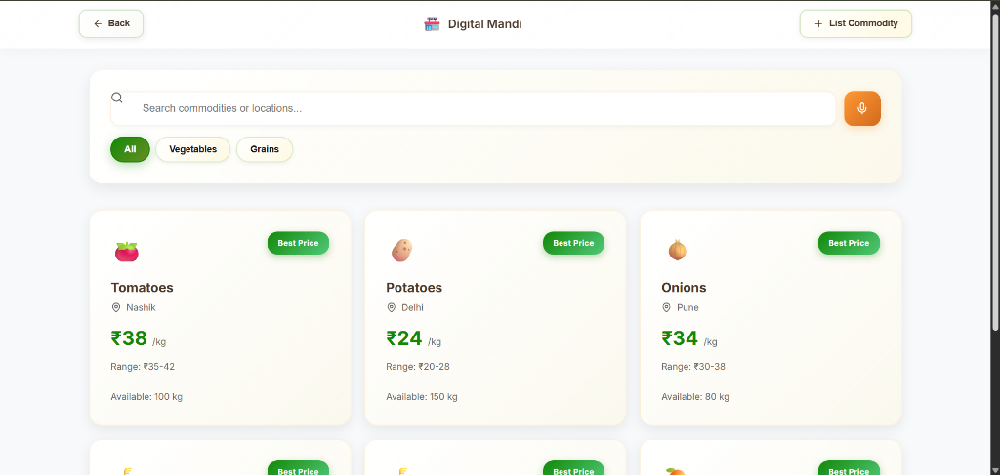
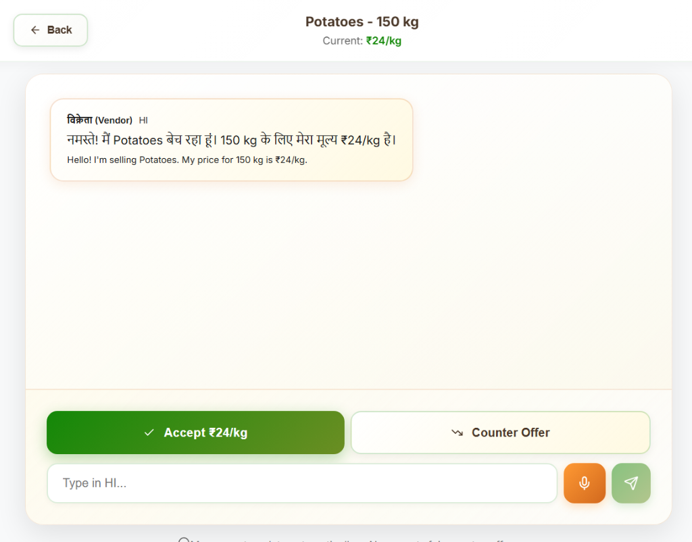

# 🌾 The Multilingual Mandi

**AI-Powered Digital Marketplace for India's Agricultural Sector**

*Viksit Bharat 2047 Initiative*

---

## 📖 Overview

The Multilingual Mandi is a modern, AI-powered digital marketplace platform designed to revolutionize agricultural commodity trading in India. Built with accessibility and inclusivity at its core, the platform supports **6 major Indian languages** and features **voice-enabled interactions** to bridge the digital divide.

### 🎯 Key Features

- **🌐 Multi-Language Support** - Hindi, Tamil, Bengali, Telugu, Marathi, Gujarati, and English
- **🎤 Voice Input** - Speak in your native language for seamless interaction
- **🤖 AI Price Discovery** - Get fair, market-based price suggestions powered by AI
- **💬 Smart Negotiation** - AI-assisted negotiation with real-time translation
- **📱 Responsive Design** - Works beautifully on desktop, tablet, and mobile
- **🎨 Government-Grade UI** - Professional, accessible, and user-friendly interface

---

## 📸 Screenshots

### Language Selection
Select your preferred language or use voice input to speak in your native tongue.



### Role Selection
Choose your role as a Vendor or Buyer with localized content.



### Vendor Dashboard
List commodities and get AI-powered fair price suggestions with voice input support.


### Digital Mandi Marketplace
Browse available commodities with search, filters, and best price indicators.



### Smart Negotiation Room
Negotiate with vendors using AI-powered suggestions and real-time translation.



---

## 🛠️ Tech Stack

### Frontend
- **React 18** - Modern UI framework
- **React Router** - Client-side routing
- **Zustand** - Lightweight state management with persistence
- **Vite** - Lightning-fast build tool
- **CSS3** - Custom styling with gradients and animations

### AI Features
- **Price Engine** - AI-powered price discovery algorithm
- **Negotiation Assistant** - Smart counter-offer suggestions
- **Voice Input** - Web Speech API integration
- **Translation** - Multi-language support system

---

## 🚀 Getting Started

### Prerequisites

- Node.js 16+ and npm/yarn installed
- Modern web browser with Web Speech API support

### Installation

1. **Clone the repository**
   ```bash
   git clone https://github.com/your-username/multilingual-mandi.git
   cd multilingual-mandi
   ```

2. **Install dependencies**
   ```bash
   npm install
   ```

3. **Start development server**
   ```bash
   npm run dev
   ```

4. **Open in browser**
   ```
   http://localhost:5173
   ```

### Build for Production

```bash
npm run build
```

The optimized production build will be in the `dist/` directory.

---

## 💡 Usage

### For Vendors

1. **Select Language** - Choose your preferred language from the home page
2. **Choose Vendor Role** - Select "मैं विक्रेता हूं" (I'm a Vendor)
3. **List Commodity** - Enter commodity name, quantity, and location (or use voice input)
4. **Get AI Price** - Receive fair price suggestions based on market data
5. **List on Mandi** - Your commodity appears in the marketplace

### For Buyers

1. **Select Language** - Choose your preferred language
2. **Choose Buyer Role** - Select "मैं खरीदार हूं" (I'm a Buyer)
3. **Browse Mandi** - Search and filter commodities
4. **Start Negotiation** - Click on any commodity to begin negotiation
5. **Use AI Suggestions** - Get smart counter-offers and accept deals

---

## 🌍 Supported Languages

| Language | Native Name | Code |
|----------|------------|------|
| Hindi | हिंदी | `hi` |
| Tamil | தமிழ் | `ta` |
| Bengali | বাংলা | `bn` |
| Telugu | తెలుగు | `te` |
| Marathi | मराठी | `mr` |
| Gujarati | ગુજરાતી | `gu` |
| English | English | `en` |

---

## 📁 Project Structure

```
multilingual-mandi/
├── public/               # Static assets
├── screenshots/          # Application screenshots
├── src/
│   ├── ai/              # AI modules (price engine, negotiation)
│   ├── components/      # Reusable UI components
│   ├── data/            # Mock data and constants
│   ├── hooks/           # Custom React hooks
│   ├── pages/           # Page components
│   ├── store/           # Zustand state management
│   ├── utils/           # Utility functions and translations
│   ├── App.jsx          # Main app component
│   ├── index.css        # Global styles
│   └── main.jsx         # Entry point
├── index.html
├── package.json
├── vite.config.js
└── README.md
```

---

## 🎨 Design Philosophy

### Government-Grade UI
- Clean, professional interface suitable for national platforms
- High contrast for accessibility
- Large touch targets for mobile users
- Premium gradients and shadows for visual depth

### Inclusive Design
- Multi-language support for linguistic diversity
- Voice input for low-literacy users
- Simple, intuitive workflows
- Responsive across all devices

### Performance
- Fast loading with Vite
- Optimized bundle size
- Lazy loading for images
- Local state persistence

---

## 🔮 Future Enhancements

- [ ] SMS/WhatsApp notifications
- [ ] Payment gateway integration
- [ ] Real-time market price updates
- [ ] Verified vendor/buyer badges
- [ ] Transaction history
- [ ] Analytics dashboard
- [ ] Mobile app (React Native)
- [ ] Blockchain-based transparency

---

## 🤝 Contributing

Contributions are welcome! Please feel free to submit a Pull Request.

1. Fork the repository
2. Create your feature branch (`git checkout -b feature/AmazingFeature`)
3. Commit your changes (`git commit -m 'Add some AmazingFeature'`)
4. Push to the branch (`git push origin feature/AmazingFeature`)
5. Open a Pull Request

---

## 📄 License

This project is licensed under the MIT License - see the LICENSE file for details.

---

## 👏 Acknowledgments

- **Viksit Bharat 2047** - Inspiration for digital India initiative
- **Indian Agricultural Community** - For guidance and requirements
- **Open Source Community** - For amazing tools and libraries

---

## 📞 Contact

For questions, suggestions, or support:

- **Email**: support@multilingulmandi.in
- **Website**: https://multilingualmandi.in
- **GitHub**: https://github.com/your-username/multilingual-mandi

---

<div align="center">

**Built with ❤️ for Bharat's Farmers and Traders**

*Empowering agricultural commerce through technology and language accessibility*

🌾 **Jai Kisan! Jai Vigyan!** 🌾

</div>
